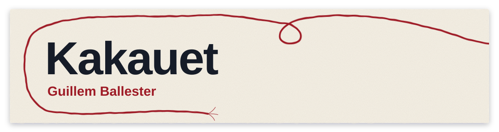

I'm **Guillem Ballester** (Kakauet). At 11 I started making games in [Scratch](https://scratch.mit.edu/users/A_A_D09): I published 23, and [Rock Rise](https://scratch.mit.edu/projects/844168404/) passed 74,000 views. I'm now in my last year of high school, about to start university.

I code for two reasons:

- **If I need something and nothing out there convinces me, I build it.**
- **If something makes me curious, I try it**, especially training AI models.

## Now: Dina

[**Dina**](https://github.com/Kakauet/Dina) is a Spanish voice assistant for Android that runs entirely on the phone, with no internet. A 1.2B model, fine-tuned on thousands of examples, understands what you ask and the code carries it out. It passes 86% of the 432 tests in my own benchmark.

  
  

## Tools I built for myself

- **[tasks](https://github.com/Kakauet/tasks)**: tasks and calendar in one, with drag and drop. It's how I organize my studies. `Next.js` `TypeScript` `Supabase`
- **[HTML Viewer](https://github.com/Kakauet/HTML-Viewer)**: drop in an HTML file, or a multi-file project, and see it instantly. `JavaScript`

## Experiments

**Eros**: language models trained from scratch on my RTX 4060.

| Model | Parameters | Tokens | ARC-E | ARC-C | OBQA | HellaSwag | SPARK |
|---|--:|--:|--:|--:|--:|--:|--:|
| **Eros 4.0 mini** | **34M** | **1B** | **40.0** | **24.7** | **29.8** | 27.7 | 66.8 |
| GPT-2 small | 124M | ~9B\* | 38.4 | 22.7 | 26.0 | 29.9 | 66.8 |
| **Eros 4.0 ultra** | **191M** | **4B** | **48.5** | **28.9** | **37.0** | 35.7 | **80.5** |
| GPT-2 large | 774M | ~9B\* | 46.7 | 26.8 | 29.6 | 43.1 | 78.4 |

With 4× fewer parameters, Eros 4.0 ultra beats GPT-2 large on ARC, OpenBookQA and SPARK (my own benchmark). Eros 4.0 mini, with almost 4× fewer parameters than GPT-2 small, beats it on ARC and OpenBookQA and ties on SPARK.

\* GPT-2 was trained on WebText, about 9B tokens. OpenAI never published how many epochs it ran.

**Fluids with AI**: a model that acted as a single particle to simulate a fluid. It didn't work, but it was my first AI project.

## Journey

Next: university, learning everything I can, and becoming a fluent programmer on my own.

[guillemkakau@gmail.com](mailto:guillemkakau@gmail.com)
